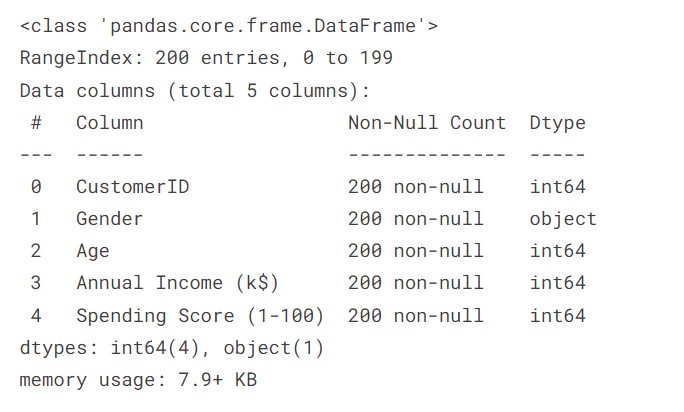
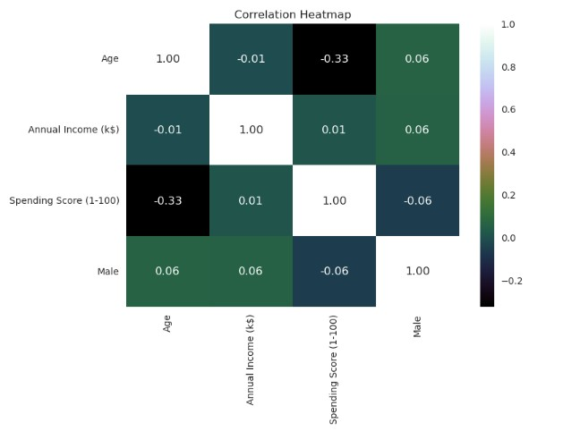
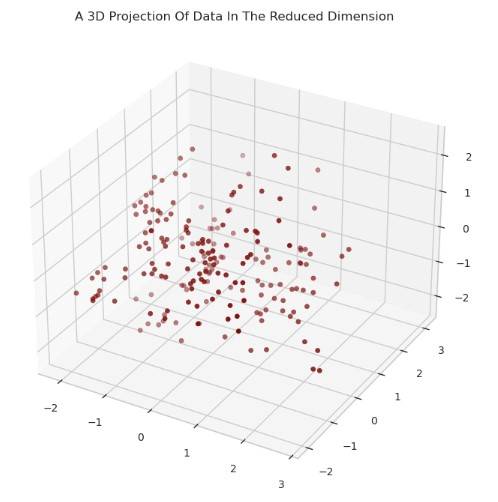
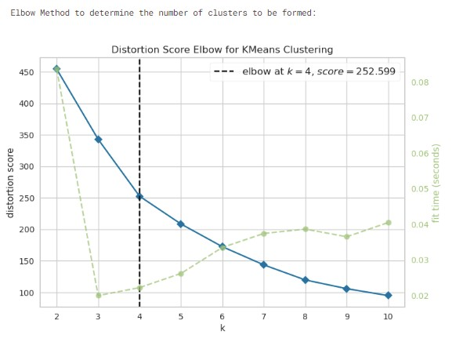
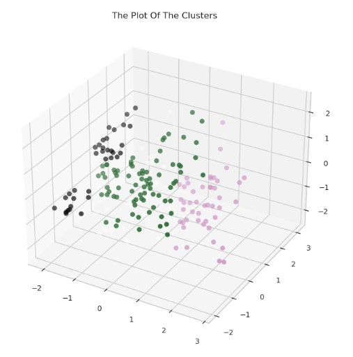
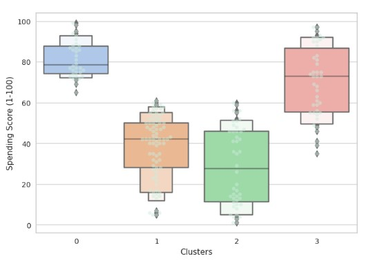
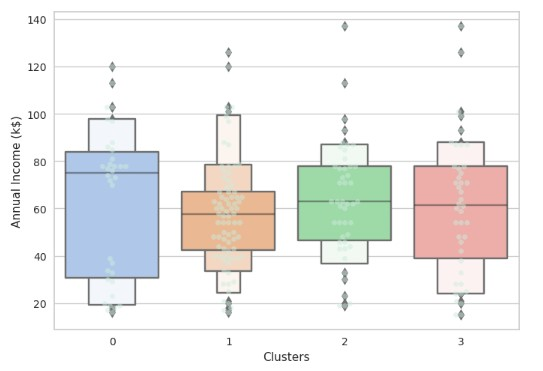
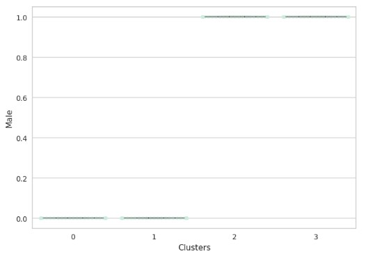

# Mall-Customer-Segmentation-Clustering

**This project** involves performing unsupervised clustering on customer records from a groceries firm's database. Customer segmentation aims to group customers based on similarities in each cluster, optimizing their significance to the business. By dividing customers into segments, the company can tailor products to meet distinct needs and behaviors, effectively catering to the concerns of different customer types.

## Data Processing & Understanding
**About the Data**
Overall, the dataset contains information about 200 customers, including their unique identifiers, gender, age, annual income, and spending score. The data appears to be complete with no missing values (non-null entries in all columns).

From the Above output, we can conclude that:
*There are no missing values in come
*Most of the values except for Gender are integers

**Feature Engineering and Handling**

Changing Value - To perform clustering analysis effectively, it is essential to convert all values to numeric format. To achieve this, we will transform the "Gender" column into binary representation, where "1" represents one gender category and "0" represents the other. This numerical conversion will enable us to apply powerful clustering techniques and gain deeper insights from the data.

Cleaning the data - As CustomerID does not play a significant role in the clustering analysis, it would be beneficial to remove this column from the dataset. By dropping this irrelevant feature, we can streamline the data and focus solely on the relevant attributes that contribute to the clustering process, leading to a more efficient and accurate analysis.

**Preprocessing**
In the context of customer segmentation analysis, pairplot is a valuable tool. It allows data scientists to quickly explore the relationships between different customer attributes (such as age, annual income, and spending score) simultaneously. 

**Data Visualization**
PairPlot

Corremap

## Scaling and Dimensionality Reduction

## Clustering and Model Evaluation

## Profiling and conclusion

