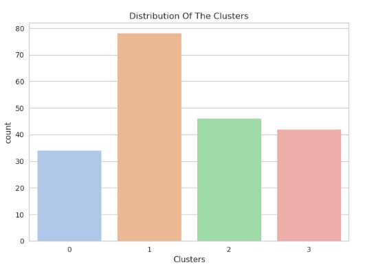

# Mall-Customer-Segmentation-Clustering

**This project** involves performing unsupervised clustering on customer records from a groceries firm's database. Customer segmentation aims to group customers based on similarities in each cluster, optimizing their significance to the business. By dividing customers into segments, the company can tailor products to meet distinct needs and behaviors, effectively catering to the concerns of different customer types.

## Data Processing & Understanding
**About the Data**

Overall, the dataset contains information about 200 customers, including their unique identifiers, gender, age, annual income, and spending score. The data appears to be complete with no missing values (non-null entries in all columns).

From the Above output, we can conclude that:
*There are no missing values in come
*Most of the values except for Gender are integers

**Feature Engineering and Handling**

Changing Value - To perform clustering analysis effectively, it is essential to convert all values to numeric format. To achieve this, we will transform the "Gender" column into binary representation, where "1" represents one gender category and "0" represents the other. This numerical conversion will enable us to apply powerful clustering techniques and gain deeper insights from the data.

Cleaning the data - As CustomerID does not play a significant role in the clustering analysis, it would be beneficial to remove this column from the dataset. By dropping this irrelevant feature, we can streamline the data and focus solely on the relevant attributes that contribute to the clustering process, leading to a more efficient and accurate analysis.

**Data Visualization**

In the context of customer segmentation analysis, pairplot is a valuable tool. It allows data scientists to quickly explore the relationships between different customer attributes (such as age, annual income, and spending score) simultaneously. 

Based on the visualization, we can draw some preliminary business insights. Within the dataset, females tend to be older than males, have higher income levels than males, and exhibit higher spending behavior compared to males. These observations could be valuable for businesses in understanding the demographic and spending patterns of their customers, potentially leading to targeted marketing strategies and product offerings based on gender-related preferences and behaviors.

## Scaling and Dimensionality Reduction
In this project, the final classification relies on multiple factors represented as attributes or features. Dealing with a large number of features can be challenging, especially when many of them are correlated and redundant. To address this, I will perform dimensionality reduction on the selected features before using them in the classifier.

Dimensionality reduction aims to reduce the number of variables while preserving essential information. In this case, I will use Principal Component Analysis (PCA), a technique that effectively reduces dimensionality while maintaining interpretability and minimizing information loss.

The steps involved in this section include performing dimensionality reduction with PCA and plotting the reduced dataframe. For this project, I will reduce the dimensions to 3 to better understand the underlying patterns and relationships in the data.

## Clustering and Model Evaluation
With the attributes now reduced to three dimensions, the next step is to perform clustering using Agglomerative clustering, a hierarchical method that involves merging examples until the desired number of clusters is achieved.

The clustering process involves the following steps:

*Elbow Method*: Determine the optimal number of clusters to be formed using the Elbow Method, which helps identify the point where the clustering performance starts to level off.

*Agglomerative Clustering*: Perform clustering using Agglomerative Clustering with the determined number of clusters.

*Examine Clusters*: Visualize the clusters formed through a scatter plot to gain insights into the patterns and relationships within the data.

Based on the analysis, it appears that four clusters would be the optimal choice for this dataset. Now, we'll proceed by fitting the Agglomerative Clustering Model to obtain the final clusters.

In the absence of labeled data for evaluation, this unsupervised clustering analysis allows us to explore and understand the patterns within the clusters formed. Through exploratory data analysis, we can draw meaningful conclusions about the nature of these clusters. Upon initial inspection, the data appears to be fairly distributed among the clusters.

## Profiling and conclusion
With the clusters formed and insights gained into their purchasing habits, we will now profile the customers within each cluster. This analysis will help us identify our star customers who are highly valuable to the retail store, as well as those who may require more attention from the marketing team. By understanding the characteristics and preferences of each cluster, we can tailor marketing strategies and enhance customer satisfaction and loyalty.

*Spending Score*

*Age*

*Income Level*

*Gender*

Here are the characteristics of the 4 different customer clusters from the analysis:

**Cluster 0:**
High-spending customers.
Young age group (20-30 years old).
Medium to high-income level.
Predominantly female.

**Cluster 1:**
Lower spending customers.
Older age group (35-50 years old).
Medium to low income level.
Predominantly female.

**Cluster 2:**
Lowest spending customers.
Oldest age group (45-60 years old).
Medium income level.
Predominantly male.

**Cluster 3:**
High spending customers.
Young age group (25-35 years old).
Medium income level.
Predominantly male.

These distinct customer segments provide valuable insights for the retail store's marketing strategy. By understanding the preferences and spending habits of each cluster, the store can tailor targeted marketing campaigns to enhance customer engagement, increase sales, and ultimately improve overall business performance.
