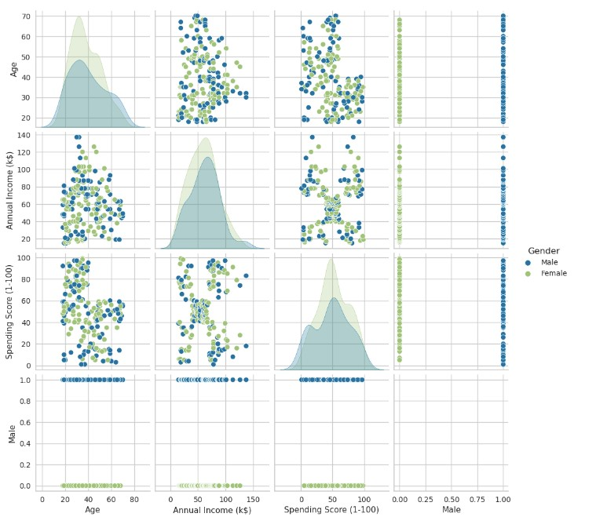

# Mall-Customer-Segmentation-Clustering

This project involves performing unsupervised clustering on customer records from a groceries firm's database. Customer segmentation aims to group customers based on similarities in each cluster, optimizing their significance to the business. By dividing customers into segments, the company can tailor products to meet distinct needs and behaviors, effectively catering to the concerns of different customer types.

## About the data

## Data Processing & Understanding

**Feature Engineering and Handling**
**Preprocessing**
**Data Visualization**
PairPlot

Corremap

## Scaling and Dimensionality Reduction

## Clustering and Model Evaluation

## Profiling and conclusion

